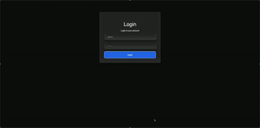
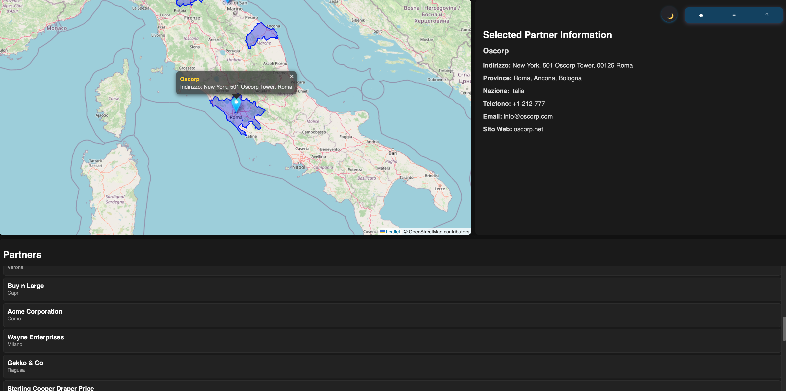
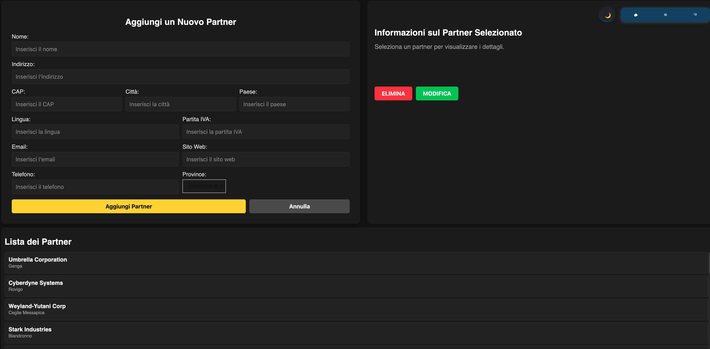

# Partner Map Application

Questa è un'applicazione web interattiva per la visualizzazione e la gestione di partner 
commerciali (dipende dalle vostre idee cosa volete visualizzare) su una mappa geografica. 
L'applicazione consente di aggiungere, modificare ed eliminare i partner, visualizzare le loro informazioni dettagliate, e visualizzare i loro confini delle province di pertinenza.

### Demo (controlla il video dentro la cartella 'screenshots')

 

**Visualizzazione Interattiva della Mappa:** Utilizzo di Leaflet per visualizzare una mappa dell'Italia con i marker dei partner.

## Tutti partners sulla mappa

 
### Partner selezionato, visualizzano le sue province.

## Caratteristiche Principali

*   **Gestione dei Partner:**
    *   Aggiunta di nuovi partner tramite un form.
    *   Modifica di partner esistenti, con precompilazione del form.
    *   Eliminazione di partner con conferma.
    ### Form per modificare partners
    

     
*   **Informazioni Dettagliate:** Visualizzazione delle informazioni del partner selezionato in un'apposita sezione.
*   **Confini delle Province:** Visualizzazione dei confini delle province di pertinenza di ogni partner.
*   **Geocoding:** Utilizzo di Nominatim API per ottenere le coordinate geografiche dei partner.
*   **Cache delle Coordinate:** Utilizzo di `localStorage` per memorizzare le coordinate e ridurre le richieste all'API Nominatim.
*    **Autenticazione:** L'accesso alle pagine con username e password demo:demo.
*    **Menu di Navigazione:** Un menu di navigazione per passare tra le 2 pagine e effettuare logout.
*   **Interazione Utente:**
    *   Selezione dei partner tramite click sulla lista o sui marker sulla mappa.
    *   Visualizzazione di un solo marker del partner selezionato alla volta, nascondendo tutti gli altri.
    *   Visualizzazione dei poligoni delle province di pertinenza dei partner sulla mappa.
*   **Validazione dei Dati:**
    *   Validazione dei dati lato client e server per garantire la correttezza dei dati.
    *   I dati dei form vengono validati e salvati nel database con successo.

## Tecnologie Utilizzate

*   **Frontend:**
    *   **HTML5:** Struttura della pagina web.
    *   **CSS3:** Stili e layout dell'applicazione.
    *   **JavaScript:** Logica di interazione utente, gestione della mappa e chiamate API.
    *   **Leaflet:** Libreria JavaScript per la visualizzazione interattiva della mappa.
    *   **Tagify:** Libreria per la gestione dei tag per l'input delle province.
*   **Backend:**
    *   **PHP:** Elaborazione delle richieste lato server, gestione del database e sessioni utente.
    *   **MySQL:** Database per la memorizzazione dei dati dei partner e degli utenti.
    *   **PDO (PHP Data Objects):** Utilizzato per la connessione al database in modo sicuro.
    *   **Nominatim API:** Utilizzata per ottenere le coordinate geografiche dalle città.

## Struttura dei File

*   **`index.php`:** File principale per la gestione delle richieste e il routing.
*   **`public/` (Root Pubblica):**
    *   **`public/index.html`:** Contiene la struttura HTML dell'applicazione principale (dashboard).
    *   **`public/manage_partners.html`:** Contiene la struttura HTML per la gestione dei partner.
    *   **`public/login.html`:** Contiene la struttura HTML per la pagina di login.
    *   **`public/css/`:** Contiene i fogli di stile CSS.
    *   **`public/js/`:** Contiene i file JavaScript.
    *   **`public/data/`:** Contiene dati come `limits_IT_provinces.geojson`.
*  **`src/` (Cartella Fuori dalla Root Pubblica):**
    *   **`src/db_connect.php`:** Contiene il codice per la connessione al database utilizzando PDO.
    *   **`src/php/auth/`:** Contiene i file per l'autenticazione.
        *   **`src/php/auth/check_login.php`:** Verifica se l'utente è loggato.
        *   **`src/php/auth/login.php`:** Gestisce il processo di login.
        *   **`src/php/auth/logout.php`:** Gestisce il processo di logout.
    *  **`src/php/partners/`:** Contiene i file per la gestione dei partner.
        *   **`src/php/partners/get_partners.php`:** Recupera i dati dei partner dal database.
        *   **`src/php/partners/get_provinces.php`:** Recupera le province dal database.
        *   **`src/php/partners/save_partner.php`:** Aggiunge un nuovo partner al database.
        *   **`src/php/partners/update_partner.php`:** Aggiorna i dati di un partner nel database.
        *   **`src/php/partners/delete_partner.php`:** Elimina un partner dal database.

**

